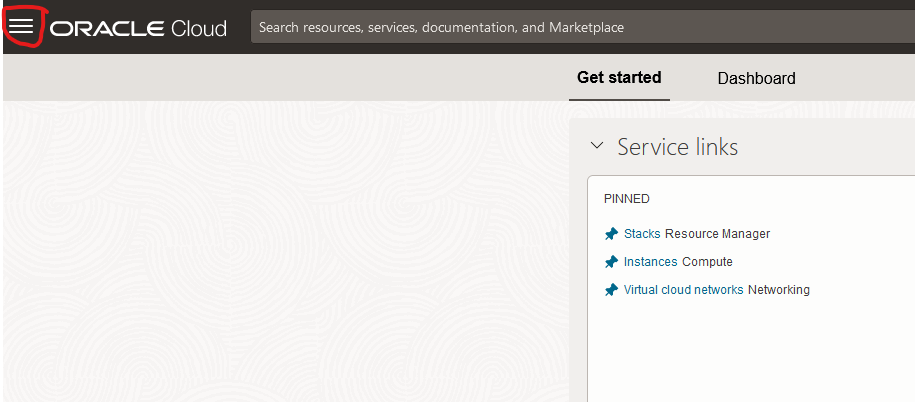

# .Net Deployment Quickstart for Oracle Cloud Infrastructure

This quickstart will help you to create infrastructure to deploy a .NET application inside of your OCI Tennancy in a highly available fashion. The quick start leverage a sample .NET 8 application depoloyed to two ubuntu servers and leverages a kload balenver to manage high availability.  The quick start will deploy the following into your arrount:

* 1 VCN
* 1 Subnet
* 1 rout table
* 1 security list
* 1 Load Balancer
* 2 Ubuntu Linux Instances

The Ubuntu linux instances are automatically configured via a Cloud Init script which performs the following actions:

* Installs the latest version of .NET
* Installs NginX 
* Installs FirewallD
* Configures the firewall to allow HTTP traffic
* Sets up an ASP .NET Core 8 web application to run as a service
* Configured NginX to serve the application

Usage:
You can use this quick start in one of the following ways:

## Clone
You can clone the github repository and then drop the **tf_project** folder onto the OCI resurce manager

## Download the zip file
You can download the release zip file and use that as a single file deployment onto the OCI Resource Manage

# Instructions

1. Log into your OCI Account
1. From the OCI console, open the hamburger icon

1. Select the option for the Resource Manager under the Development Tools section

1. Choose Stacks

1. Click Create Stack

1. Drag and Drop the tf_project folder from the cloned directory to the OCI console

1. Drop the folder onto the console

1. Click Next

1. Optionally add SSH keys that can be used to log into the linux instances

1. Click Next

1. Select the "Run Apply" option option and then click Create

1. Wait for the stack to finish completing

1. Once the stack completes, you can scroll the log window to the bottom and see the IP Addresses

There will be one IP addrress for the load balancer, and one IP address for each instance.

*It may take a few minutes for the load balancer to fully connect to the two back end instances. If you receive a server error, wait a minute or two and try again.*

